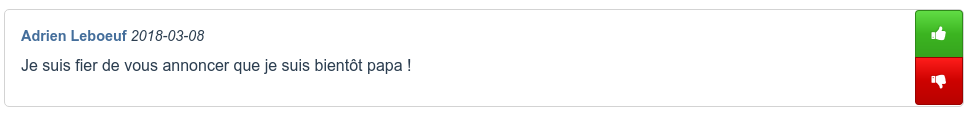
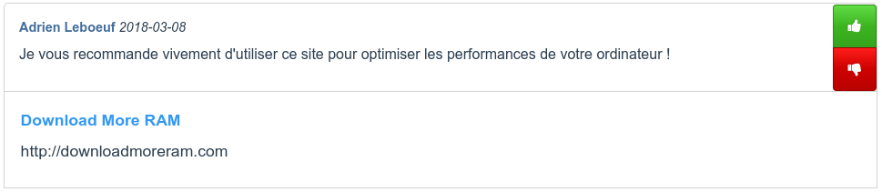

## Flux d'actualités

Le flux d'actualités est le centre névralgique du réseau social ; vous pouvez y consulter toutes les publications que vous avez émises ou que vos amis ont émises, à condition qu'ils aient configuré la visibilité de leurs publications pour que vous y ayiez droit.

Vous pouvez accéder au flux d'actualités à tout moment en cliquant sur « Flux » dans la barre de navigation.

## Mur

Le mur vous permet de consulter l'ensemble de vos publications. Si votre configuration de visibilité des publications est définie à « Moi uniquement, » il n'y aura que vous qui pourrez observer ces publications.

## Types d'actualités

### Publications de messages

Il est possible de poster sur TweetBook de simples publications texte. [Voyez ici comment.](sendtext.md)

### Partage de liens

Vous avez trouvé quelque chose sur Internet dont vous souhaitez faire part à vos amis ? Vous pouvez [partager un lien](sendlink.md) avec eux.

### Réactions

Lorsque vous ou des amis réagissent à des publications d'autres personnes, par un *J'aime* ou un *J'aime pas*, les réactions sont partagées aux amis. [En savoir plus](reaction.md)

### Ajouts en ami

Lorsque vous ajoutez d'autres personnes en ami, vos amis en sont également notifiés. [Découvrez comment vous faire des amis](friends.md)

