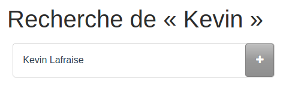
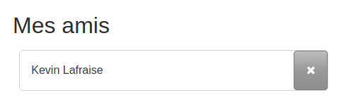

## Rechercher des personnes

Vous pouvez rechercher des personnes inscrites sur TweetBook pour les ajouter en tant qu'ami(e)s à l'aide de la zone de recherche dans votre liste d'amis. Cliquez sur « Amis » dans la barre de navigation pour afficher votre liste d'amis et la zone de recherche. Vous pouvez saisir tout ou partie du nom de famille ou du prénom d'une personne que vous recherchez, et toutes les personnes correspondant à vos termes de recherche seront affichées.

À côté de chaque nom de personne, un bouton vous permet d'ajouter la personne recherchée en tant qu'ami(e).

## Liste d'amis

Pour accéder à votre liste d'amis, cliquez sur « Amis » dans la barre de navigation. Votre liste d'amis s'affiche alors, et il vous sera possible de consulter la liste des personnes avec lesquelles vous êtes ami.

En cliquant sur le bouton à droite du nom d'une personne, vous pourrez retirer cette personne de la liste d'amis.