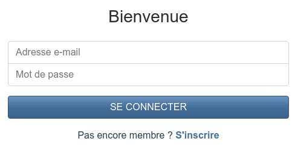
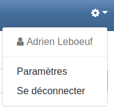

## Se connecter

Accédez à la page d'accueil de TweetBook et cliquez sur le lien en dessous du fomulaire d'inscription, *Se connecter*. Le formulaire de connexion s'affiche.

Saisissez votre adresse e-mail et le mot de passe configuré lors de votre inscription, puis cliquez sur le bouton **Se connecter**.

Vous serez alors connecté à TweetBook pour cette session.

## Se déconnecter

Dans la barre de navigation de l'application, cliquez en haut à droite sur l'icône de menu.

Cliquez ensuite sur **Se déconnecter** pour vous déconnecter. Vous êtes automatiquement redirigé vers la page d'accueil de TweetBook.