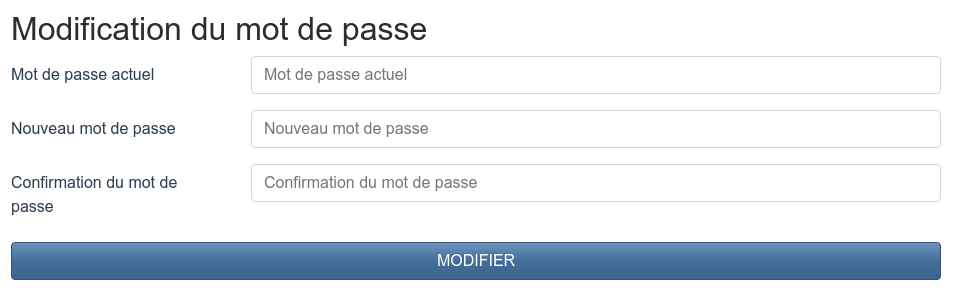
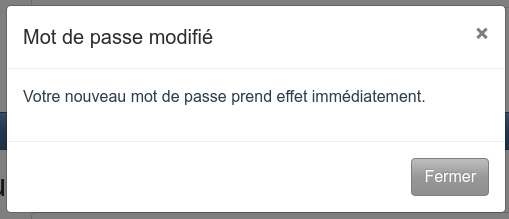

[Connectez-vous](login.md) si ce n'est pas déjà fait, puis ouvrez le menu de l'application situé dans la barre de navigation.

Dans le menu, sélectionnez **Paramètres**. Nous allons nous intéresser à la section *Modification du mot de passe* dans la page qui s'affiche.

Commencez par remplir le champ *Mot de passe actuel* avec votre mot de passe actuel. Ce champ est nécessaire pour s'assurer que c'est bien vous qui faites la modification, et pas quelqu'un d'autre qui aurait obtenu d'une manière ou d'une autre un accès à cette page.

Ensuite, complétez *Nouveau mot de passe* et *Confirmation du mot de passe* pour indiquer votre nouveau mot de passe. Tapez votre nouveau mot de passe dans les deux champs ; afin d'éviter qu'une erreur de saisie ne vous bloque hors de votre compte, la confirmation de mot de passe permet de s'assurer que vous ne vous trompez pas.

Cliquez ensuite sur **Modifier** pour effectuer la modification de votre mot de passe. Un message de confirmation s'affiche alors.

