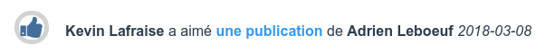

Lorsque vous [consultez une actualité](feeds.md), des boutons d'action colorés sont disponibles sur la droite.

Le bouton vert, affichant un pouce vers le haut, vous permet d'indiquer que vous aimez une publication. À l'inverse, le bouton rouge, affichant un pouce vers le bas, vous permet d'indiquer que vous n'aimez pas une publication.

Vous pouvez cliquer sur un des boutons pour indiquer votre réaction à la publication. À tout moment, vous pouvez également annuler votre réaction à une publication en cliquant à nouveau sur celle-ci. De même, vous pouvez changer d'avis et votre ancienne réaction sera remplacée par la nouvelle.

Lorsque vous réagissez à une publication, une actualité est générée sur votre mur.

