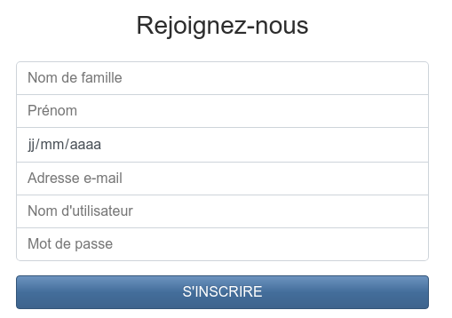
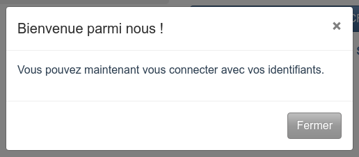

Cette page va vous expliquer comment procéder à une inscription sur TweetBook.

Commencez par accéder à la page d'accueil du site. De là, un formulaire d'inscription est à votre disposition.

Complétez les champs tels que demandé ; votre nom de famille, votre prénom, votre date de naissance.

Saisissez également une adresse e-mail valide, qui sera utilisée pour effectuer la connexion, ainsi qu'un nom d'utilisateur et un mot de passe.

Vous pourrez procéder à la modification de vos informations plus tard, en [configurant votre compte](settings.md).

Une fois les informations saisies, cliquez sur « S'inscrire » pour procéder à l'inscription. Un message de confirmation s'affiche alors.

Vous pouvez maintenant [procéder à votre première connexion](login.md).