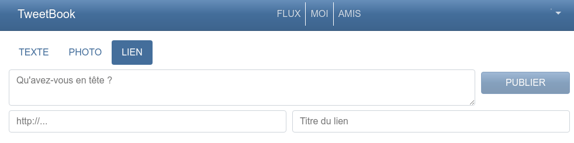
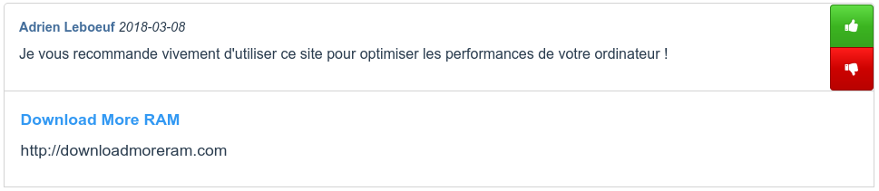

[Connectez-vous](login.md) si ce n'est pas déjà fait, et accédez au flux d'actualités ou à votre mur de publications. Cliquez sur le bouton *Lien* pour sélectionner une publication de type lien.

Dans la zone de texte, vous pouvez inscrire un message de votre choix. Les deux champs situés en-dessous vous permettent de définir l'URL du lien que vous souhaitez partager et le titre qui sera affiché comme nom du lien.

Cliquez ensuite sur le bouton **Publier** pour partager votre lien. Votre mur affiche alors votre nouvelle publication.

