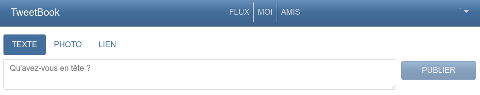
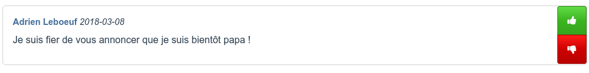

[Connectez-vous](login.md) si ce n'est pas déjà fait, et accédez au flux d'actualités ou à votre mur de publications. Cliquez sur le bouton *Texte* pour sélectionner une publication de type texte.

Dans la zone de texte, vous pouvez inscrire un message de votre choix. Cliquez ensuite sur le bouton **Publier** pour partager votre message. Votre mur affiche alors votre nouvelle publication.

