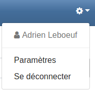

[Connectez-vous](login.md) si ce n'est pas déjà fait, puis ouvrez le menu de l'application situé dans la barre de navigation.

Dans le menu, sélectionnez **Paramètres**. Nous allons nous intéresser à la section *Paramètres du compte* dans la page qui s'affiche.

Les champs du formulaire se remplissent automatiquement avec les informations que vous avez indiquées pour votre compte, vous permettant ainsi de les consulter.

* Nom de famille et prénom : Permettent d'indiquer votre identité aux autres utilisateurs ;
* Date de naissance : Utilisée pour certifier que vous atteignez les limites d'âge minimum pour accéder au réseau ;
* Nom d'utilisateur : Utilisé comme un nom unique pouvant notamment vous identifier dans des URL ;
* Adresse e-mail : Utilisée afin d'effectuer votre connexion à votre compte TweetBook ;
* Visibilité des publications : Détermine vos paramètres de confidentialité pour les publications que vous produisez.
  * Moi uniquement : Seul vous pouvez consulter vos publications ;
  * Amis seulement (paramètre par défaut) : Vos publications ne peuvent être vues que par les personnes avec lesquelles [vous êtes amis](friends.md) ainsi que vous ;
  * Tout le monde : Vos publications sont visibles par vous, vos amis et n'importe quel utilisateur de TweetBook.

Vous pouvez modifier les champs de votre choix et cliquer sur **Enregistrer** pour valider vos modifications.

